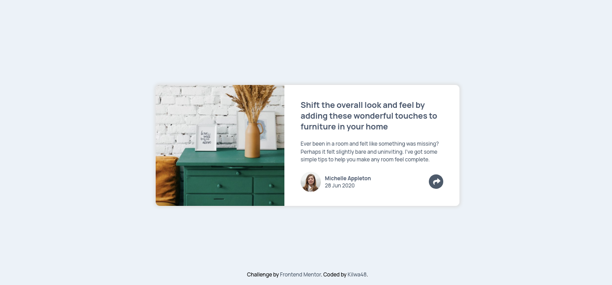

# Frontend Mentor - Article preview component

This is a solution to the [Article preview component challenge on Frontend Mentor](https://www.frontendmentor.io/challenges/article-preview-component-dYBN_pYFT). Frontend Mentor challenges help you improve your coding skills by building realistic projects. 

## Table of contents

- [Frontend Mentor - Article preview component solution](#frontend-mentor---article-preview-component-solution)
  - [Table of contents](#table-of-contents)
  - [Overview](#overview)
    - [The challenge](#the-challenge)
    - [Screenshot](#screenshot)
    - [Links](#links)
  - [My process](#my-process)
    - [Built with](#built-with)
  - [Author](#author)

## Overview

### The challenge

Users should be able to:

- view the optimal layout for the component depending on their device's screen size
- see the social media share links when they click the share icon

### Screenshot

### Links

- Live Site URL: [Demo](https://kilwa220.github.io/article-preview-component/)

## My process

### Built with

- Semantic HTML5 markup
- CSS custom properties
- Flexbox
- CSS Grid
- Mobile-first workflow

## Author

- Website - [Kilwa48](https://kilwa220.github.io/Kilwa_Template/)
- Frontend Mentor - [@Kilwa220](https://www.frontendmentor.io/profile/Kilwa220)
- Linkedin - [@jalal-eddine lhachmi](https://www.linkedin.com/in/jalallh/)

